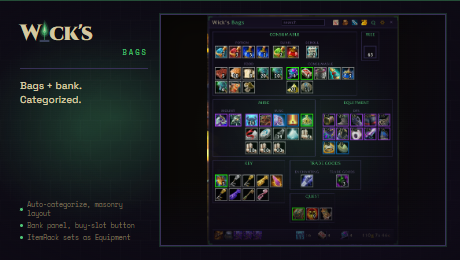

<p align="center"></p>

# Wick's Bags

> Categorized bag panel for TBC Classic. Auto-categorize, search, gold display, custom rules, pluggable category sources.

Part of the **[Wick suite](https://github.com/Wicksmods/WickSuite)**: precision addons built around a single fel-green-on-deep-purple aesthetic.

<!-- wick:suite-table:start -->
| Addon | GitHub | CurseForge |
|---|---|---|
| **Wick's TBC BIS Tracker** | [repo](https://github.com/Wicksmods/WickidsTBCBISTracker) | [CurseForge](https://www.curseforge.com/wow/addons/wicks-tbc-bis-tracker) |
| **Wick's CD Tracker** | [repo](https://github.com/Wicksmods/WicksCDTracker) | [CurseForge](https://www.curseforge.com/wow/addons/wicks-cd-tracker) |
| **Wick's Trade Hall** | [repo](https://github.com/Wicksmods/WicksTradeHall) | [CurseForge](https://www.curseforge.com/wow/addons/trade-hall) |
| **Wick's Macro Builder** | [repo](https://github.com/Wicksmods/WicksMacroBuilder) | [CurseForge](https://www.curseforge.com/wow/addons/wicks-macro-builder) |
| **Wick's Combat Log** | [repo](https://github.com/Wicksmods/WicksCombatLog) | [CurseForge](https://www.curseforge.com/wow/addons/wicks-combat-log) |
| **Wick's Stats** | [repo](https://github.com/Wicksmods/WicksStats) | [CurseForge](https://www.curseforge.com/wow/addons/wicks-stats) |
| **Wick's Quest Key** | [repo](https://github.com/Wicksmods/WicksQuestKey) | [CurseForge](https://www.curseforge.com/wow/addons/wicks-quest-key) |
| **Wick's Layers** | [repo](https://github.com/Wicksmods/WicksLayers) | [CurseForge](https://www.curseforge.com/wow/addons/wicks-layers) |
| **Wick's Totems and Things** | [repo](https://github.com/Wicksmods/WicksTotemsAndThings) | [CurseForge](https://www.curseforge.com/wow/addons/wicks-totems-and-things) |
| **Wick's Bags** | [repo](https://github.com/Wicksmods/WicksBags) | [CurseForge](https://www.curseforge.com/wow/addons/wicks-bags) |
| **Wick's Travel Form** | [repo](https://github.com/Wicksmods/WicksTravelForm) | [CurseForge](https://www.curseforge.com/wow/addons/wicks-travel-form) |

**Community:** [Discord](https://discord.gg/GWGTMhYBZY)
<!-- wick:suite-table:end -->

## Features

- **Single window** replacing the bag clutter view.
- **Auto-categorize** by item type: Equipment, Consumable, Trade Goods, Quest, Recipe, Gem, Container, Projectile, Quiver, Key, Junk, Misc.
- **Quality-color borders** so rares and epics stand out at a glance.
- **Live search** across all bags.
- **Gold display** in the header.
- **Cooldown spirals** on items with active cooldowns (potions, trinkets).
- **Use-on-click** via secure action button (left-click an item to use it).
- **Pluggable category sources** so an external addon can supply category data (TSM groups in v0.2, outfit addon in v0.3, etc.).
- **Wick chrome.** Void background, fel-green L-bracket corners, two-tone "Wick's" title, slim 28px header.

## Install

- **Manual:** download the latest ZIP from [Releases](https://github.com/Wicksmods/WicksBags/releases) and extract the `WicksBags` folder into `World of Warcraft\_classic_\Interface\AddOns\`.

## Usage

```
/wb
```

Toggles the main panel. Bind a key in *Esc to Key Bindings to AddOns to Wick's Bags* if you prefer.

| Command | Effect |
|---|---|
| `/wb` | Toggle the panel |
| `/wb show` | Show |
| `/wb hide` | Hide |
| `/wb reset` | Reset position to center |

## Compatibility

- TBC Classic Anniversary (2.5.5, Interface 20505)
- Pure Lua, no library dependencies in v0.1
- Works alongside default Blizzard bags (does not hide them yet; that is a v0.2 option)

## License

MIT for code (see [LICENSE](LICENSE)). Brand chrome and the "Wick's" wordmark are trademarked, see [TRADEMARK.md](https://github.com/Wicksmods/WickSuite/blob/main/TRADEMARK.md) in the Wick Suite repo.
