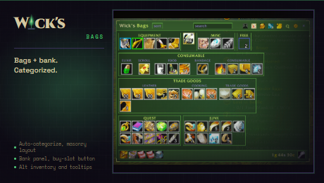

<p align="center"></p>

# Wick's Bags

> Categorized bags and bank for World of Warcraft: Forever. Auto-categorize, search, one-click sort, alt inventory and tooltips, custom rules.

Part of the **[Wick suite](https://github.com/Wicksmods/WickSuite)**: precision addons built around a single fel-green-on-deep-purple aesthetic. This branch (`forever`) is the Forever build on [WickCore](https://github.com/Wicksmods/WickCore). The TBC Anniversary build lives on `main`.

<!-- wick:suite-table:start -->
| Addon | GitHub | CurseForge |
|---|---|---|
| **Wick's TBC BIS Tracker** | [repo](https://github.com/Wicksmods/WickidsTBCBISTracker) | [CurseForge](https://www.curseforge.com/wow/addons/wicks-tbc-bis-tracker) |
| **Wick's CD Tracker** | [repo](https://github.com/Wicksmods/WicksCDTracker) | [CurseForge](https://www.curseforge.com/wow/addons/wicks-cd-tracker) |
| **Wick's Trade Hall** | [repo](https://github.com/Wicksmods/WicksTradeHall) | [CurseForge](https://www.curseforge.com/wow/addons/trade-hall) |
| **Wick's Macro Builder** | [repo](https://github.com/Wicksmods/WicksMacroBuilder) | [CurseForge](https://www.curseforge.com/wow/addons/wicks-macro-builder) |
| **Wick's Combat Log** | [repo](https://github.com/Wicksmods/WicksCombatLog) | [CurseForge](https://www.curseforge.com/wow/addons/wicks-combat-log) |
| **Wick's Stats** | [repo](https://github.com/Wicksmods/WicksStats) | [CurseForge](https://www.curseforge.com/wow/addons/wicks-stats) |
| **Wick's Quest Key** | [repo](https://github.com/Wicksmods/WicksQuestKey) | [CurseForge](https://www.curseforge.com/wow/addons/wicks-quest-key) |
| **Wick's Totems and Things** | [repo](https://github.com/Wicksmods/WicksTotemsAndThings) | [CurseForge](https://www.curseforge.com/wow/addons/wicks-totems-and-things) |
| **Wick's Bags** | [repo](https://github.com/Wicksmods/WicksBags) | [CurseForge](https://www.curseforge.com/wow/addons/wicks-bags) |
| **Wick's Travel Form** | [repo](https://github.com/Wicksmods/WicksTravelForm) | [CurseForge](https://www.curseforge.com/wow/addons/wicks-travel-form) |
| **Wick's Ledger** | [repo](https://github.com/Wicksmods/WicksLedger) | [CurseForge](https://www.curseforge.com/wow/addons/wicks-ledger) |
| **Wick's Wardrobe** | [repo](https://github.com/Wicksmods/WicksWardrobe) | [CurseForge](https://www.curseforge.com/wow/addons/wicks-wardrobe) |
| **Wick's Concession Stand** | [repo](https://github.com/Wicksmods/WicksConcessionStand) | [CurseForge](https://www.curseforge.com/wow/addons/wicks-concession-stand) |
| **Wick's Bones** | [repo](https://github.com/Wicksmods/WicksBones) | [CurseForge](https://www.curseforge.com/wow/addons/wicks-bones) |
| **Wick's Survivors** | [repo](https://github.com/Wicksmods/WicksSurvivors) | [CurseForge](https://www.curseforge.com/wow/addons/wicks-survivors) |

**Community:** [Discord](https://discord.gg/GWGTMhYBZY)
<!-- wick:suite-table:end -->

## Features

- **One window** for bags, and one for the bank, replacing the bag clutter view.
- **Auto-categorize** by item type: Equipment, Potion, Elixir, Flask, Food, Cloth, Leather, Herb, Enchanting, Quest, Recipe, Key, Junk and more, grouped under parent headers.
- **Custom rules** by item, by class and subclass, or by name pattern, plus your own categories.
- **Live search** across bags and bank.
- **One-click sort** for bags and bank, then the categories lay back out.
- **Bank tabs.** Forever's bank is purchasable tabs; the panel shows them as one categorized view, with a filter per tab and the next tab's price on the buy button.
- **Alt inventory viewer** with snapshots of every character's bags and bank, and **alt counts in item tooltips** so you know which character has the mats.
- **Watched currencies** in the bottom bar.
- **Quality borders, item level, new-item highlights, cooldown spirals, use-on-click.**
- **Profiles** keyed by character, spec, class or game mode, with export and import strings, through WickCore.
- **Wick chrome.** Void background, fel-green L-bracket corners, two-tone "Wick's" title.

## Install

Requires **[WickCore](https://github.com/Wicksmods/WickCore)**.

- **Manual:** download the latest ZIP from [Releases](https://github.com/Wicksmods/WicksBags/releases) and extract the `WicksBags` folder into the Forever client's `Interface\AddOns\` (the beta installs to `World of Warcraft\_classic_beta_\`). Do the same for `WickCore`.

## Usage

```
/wbags
```

Toggles the main panel. Bind a key in *Esc, Key Bindings, AddOns, Wick's Bags* if you prefer. The Wick minimap button and the "Wick's Mods" entry in Options also open it.

| Command | Effect |
|---|---|
| `/wbags` | Toggle the panel |
| `/wbags options` | Open the options window |
| `/wbags alts` | Open the alt inventory viewer |
| `/wbags sort` | One-click sort |
| `/wbags show` / `hide` | Show or hide |
| `/wbags reset` | Reset position to center |
| `/wbags autoopen on|off` | Auto-open at mailbox, vendor, bank |

`/wicksbags` and `/wb` are aliases.

## Compatibility

- World of Warcraft: Forever, 1.60.x, Interface 16001. Requires WickCore.
- The same code runs on TBC Anniversary through WickCore's dialect shim, but the supported TBC build is the `main` branch.

## License

MIT for code (see [LICENSE](LICENSE)). Brand chrome and the "Wick's" wordmark are trademarked, see [TRADEMARK.md](https://github.com/Wicksmods/WickSuite/blob/main/TRADEMARK.md) in the Wick Suite repo.
